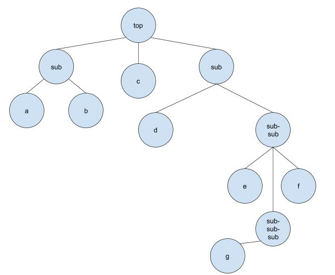
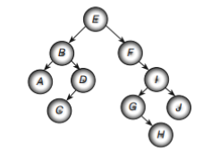

# Немного теории и ход работы.

Любое дерево - список списков, таким образом проще всего проследить вложенность. Можно, конечно, делать это и при помощи словарей, но тогда будет отсутствовать чёткая взаимосвязь, на мой взгляд. Поэтому остановимся на массивах.

Пример такого массива: 

```
t = [['a', 'b'], 'c', ['d', ['e', 'f', ['g']]]]
```  
  
___Пример дерева по этому массиву:___


  

___Основные идеи и задачи:___
1. Создать структуру деревьев, построенную на списках, через класс  

    ___Структура должна включать:___  
      1. Добавление нод  
      2. Удаление нод  
      3. Сортировка нод по правым и левым  
      4. Обход дерева  

    ___На вход: дети в виде нод, отсортированные по правым и левым (индексы 0 и 1 - соответственно)___

    ___На выход: всё дерево с вложенностью___

2. Организовать простой обход внутри класса методами left и right

3. Организовать вывод в консоль

4. Организовать вывод в окошко в текстовом виде

5. Организовать неупорядоченный граф. вывод в окошко

6. Организовать упорядоченный граф. вывод в окошко

# Ход работы.

Организуем структуру данных, которая будет строить дерево.

```
class Tree:
    def __init__(self, name='root', children=[], left=0, right=-1):
        self.name = name
        self.children = []
        if children:
            for node in children:
                self.add_node(node)

    def __repr__(self):
        return self.name

    def add_node(self, node):
        self.children.append(node)
```

Каждое наше дерево будет являться объектом этой структуры данных.  

Данное нам дерево выглядит следующим образом:



Чтобы обработать его через нашу структуру данных заведём переменную ___t___:

```
t = Tree('e', [Tree('b',
                    [Tree('a'), Tree('d',
                                     [Tree('c')])]),
               Tree('f',
                    [Tree('i',
                          [Tree('g',
                                [Tree('h')]), Tree('j')])])])
```

Теперь нужно сделать простой вывод дерева в консоль. Для этого конкретного дерева он будет выглядеть так:

```
for i in range(len(t.children)):
    t1 = '  ' + t.children[i].name
    print(t1)
    for j in range(len(t.children[i].children)):
        t2 = '     ' + t.children[i].children[j].name
        print(t2)
        for k in range(len(t.children[i].children[j].children)):
            t3 = '         ' + t.children[i].children[j].children[k].name
            print(t3)
            for c in range(len(t.children[i].children[j].children[k].children)):
                t4 = '             ' + t.children[i].children[j].children[k].children[c].name
                print(t4)
```

Но такой вывод никуда не годится, сами понимаете почему, надеюсь. Для нормального вывода нужно организовать обход дерева в глубину, печатая по пути все вершины. Иными словами, чтобы обойти дерево нужно спускаться вниз по каждой ветке до тех пор, пока мы не дойдём до конца. Для этого будем использовать рекурсивную функцию *print_tree()*:

```
def print_tree(Tree):
    print(Tree.name)
    for i in range(len(Tree.children)):
        if Tree.children[i]:
            print_tree(Tree.children[i])
```

Результат:

```
 e
 b
 a
 d
 c
 f
 i
 g
 h
 j
```

Для красивого вывода можно добавить параметры *step* и *deep*, чтобы показывать вложенность, а не только результат обхода в глубину:

```
def print_tree(Tree, deep=None, step=0):
    print(step * ' ', Tree.name)
    if deep is None:
        deep = [0, 0]
    for i in range(len(Tree.children)):
        if Tree.children[i]:
            deep[i] += 1
            step = deep[i]
            if i == 1:
                print_tree(Tree.children[i], deep, step + 1)
            else:
                print_tree(Tree.children[i], deep, step)
```
